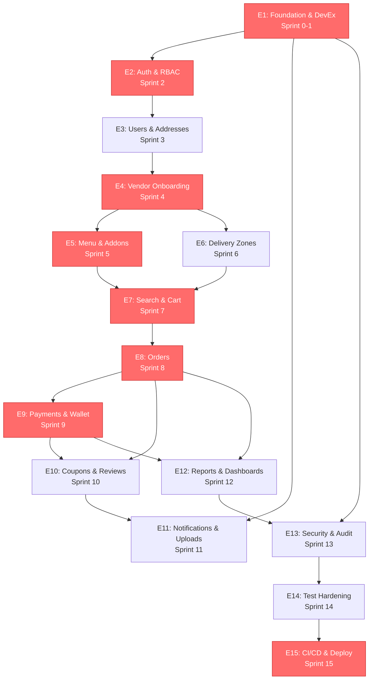
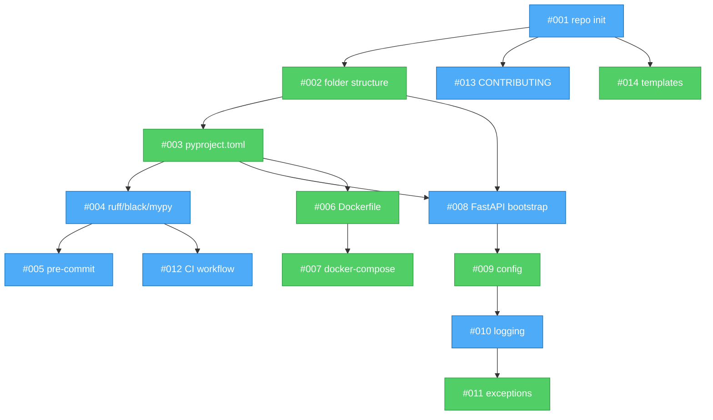

# Dependency Graph

Visual DAG of critical dependencies across the project. GitHub renders Mermaid natively — this file shows a live diagram when viewed on github.com.

For the full ordering, see [ROADMAP.md](./ROADMAP.md).

## High-level flow between epics

Red nodes are on the critical path; delays cascade to launch.

---

## Critical path issue chain

The 21-issue chain that gates production launch. Each node is an issue number.

---

## Sprint 0-2 detail (start here on Day 1)

The first sprints have the most parallelism opportunities. Two developers can work simultaneously if they respect dependency direction.

**Blue = Krishna, Green = Piyush.** Notice the parallelism: while Piyush works on #002/#003, Krishna is free to work on #013/#014.

---

## How to read these

1. **Arrows point from prerequisite to dependent.** `A → B` means "B needs A first."
2. **Same-level nodes are parallel-safe.** Two developers can work on them at the same time.
3. **Red = critical path.** If it slips, launch slips.
4. **Colors in Sprint 0-2 diagram** show suggested assignments — swap freely, but don't have both devs blocked on the same node.

## Regenerating

When issues get renumbered or dependencies change, edit this file. Mermaid syntax is simple; there's no build step. Keep it in sync with `ROADMAP.md`.